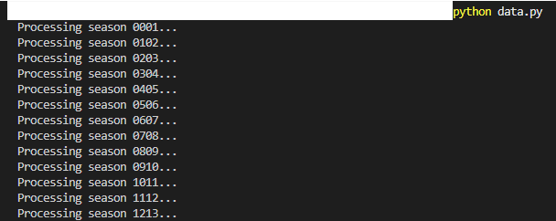
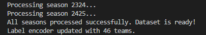
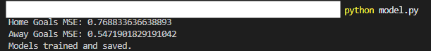
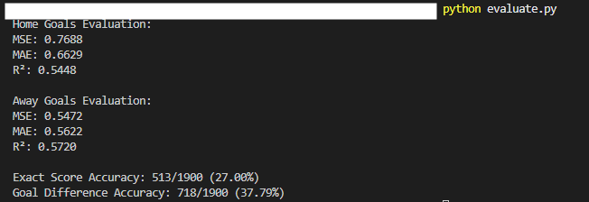
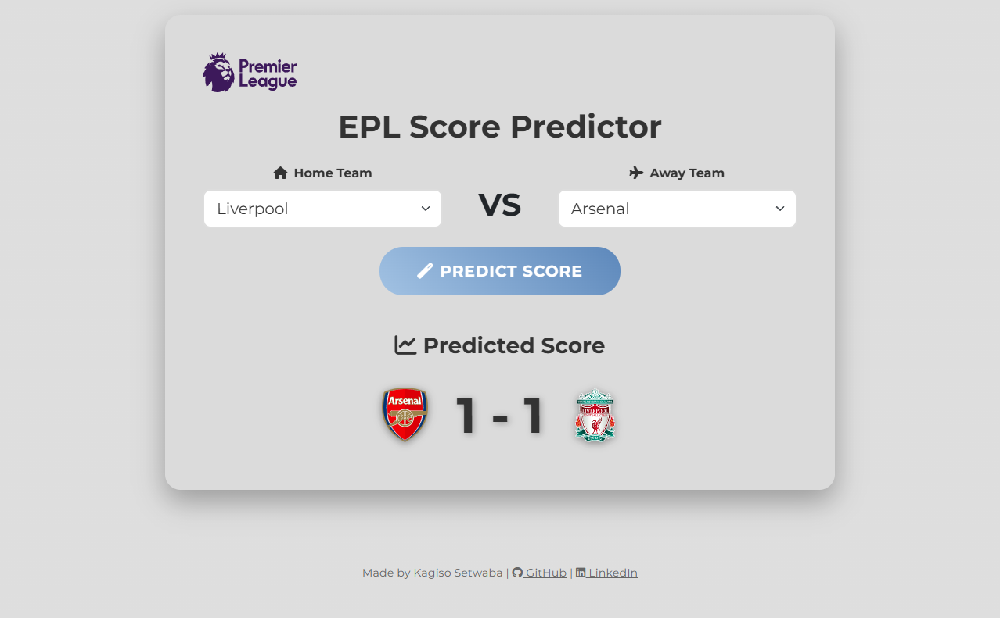
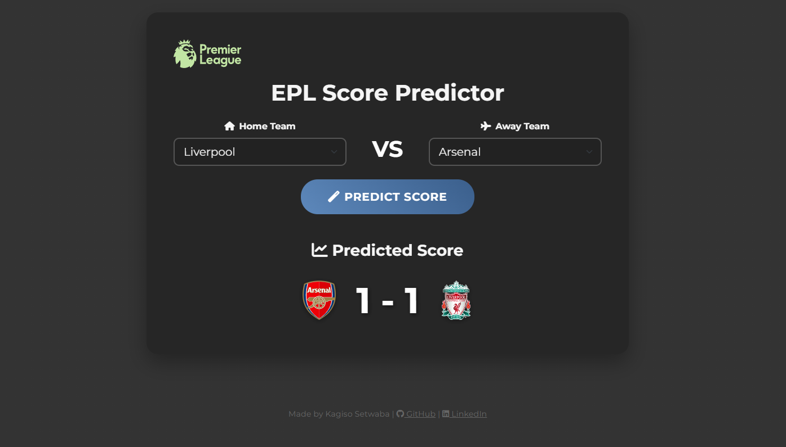
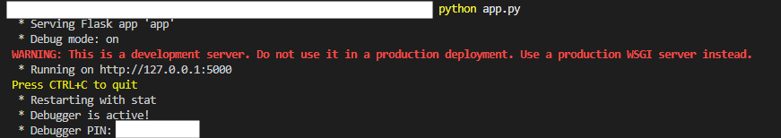

# ⚽ EPL Score Predictor

[](https://www.python.org/)
[](https://flask.palletsprojects.com/)
[](https://scikit-learn.org/)

A sophisticated machine learning project to predict scores for English Premier League matches using XGBoost Regression. Built with Flask for an intuitive web interface. ⚽📊💻

## 📋 Table of Contents

- [✨ Features](#✨-features)
- [🔧 How it Works](#🔧-how-it-works)
- [📋 Prerequisites](#📋-prerequisites)
- [🚀 Installation](#🚀-installation)
- [🎯 Usage](#🎯-usage)
- [📁 Project Structure](#📁-project-structure)
- [📸 Screenshots](#📸-screenshots)
- [🤝 Contributing](#🤝-contributing)
- [📄 License](#📄-license)

---

## ✨ Features

- ⚡ **Accurate Predictions**: Uses XGBoost Regression with Poisson objective trained on 25 seasons of EPL data for reliable score predictions.
- 📊 **Advanced Features**: Includes rolling averages, team form, strength metrics, and interaction features for superior accuracy.
- 🖥️ **User-Friendly Interface**: Clean, responsive web app built with Flask, Bootstrap, and Font Awesome.
- 🌗 **Dark/Light Theme**: Toggle between light and dark modes for a better user experience.
- 🏟️ **Team Crests**: Displays official team logos for visual appeal.
- ⚠️ **Error Handling**: Provides clear messages for unknown teams or errors.

---

## 🔧 How it Works

1. **📥 Data Collection**: Downloads historical EPL match data from football-data.co.uk for seasons 2000-01 to 2024-25.

2. **🧹 Preprocessing**: Cleans the data, selects relevant columns, encodes team names using LabelEncoder, and adds advanced features like rolling averages, form, strength, and interactions.

3. **🤖 Model Training**: Trains two XGBoost Regression models with Poisson objective:

   - One for predicting **home team goals** (FTHG)
   - One for predicting **away team goals** (FTAG)
   - Features: Encoded teams, shots on target, corners, fouls, cards, rolling goals/goals against, form, strength, and interactions.

4. **🎯 Prediction**: For given home and away teams, encodes them and uses the models to predict goals.

5. **🖥️ Web Interface**: A Flask app where users can input teams and see the predicted score with team crests.

---

## 📋 Prerequisites

- 🐍 Python 3.7+
- 🌐 Internet connection for data download

---

## 🚀 Installation

1. **Clone the Repository**:

```bash
git clone https://github.com/yourusername/epl-score-predictor.git
cd epl-score-predictor
```

2. **Create Virtual Environment** (recommended):

```bash
python -m venv .venv
.venv\Scripts\activate  # Windows
source .venv/bin/activate  # macOS/Linux
```

3. **Install Dependencies**:

```bash
pip install -r requirements.txt
```

4. **Download Data**:

```bash
python data.py
```

5. **Train Models**:

```bash
python model.py
```

---

## 🎯 Usage

1. **Run the Application**:

```bash
python app.py
```

2. **Access the App**:

- Open your browser at `http://localhost:5000`
- Select **home** and **away** teams from the dropdowns
- Click **Predict Score** ⚡ to see the result with team crests 🏟️

3. **Predict League Winner**:

```bash
python winner_predictor.py
```

- This will simulate a full EPL season using the trained models
- Displays the predicted winner and points table
  python winner_predictor.py

---

## 📁 Project Structure

```
epl-score-predictor/
├── app.py                 # Flask web application 🖥️
├── data.py                # Data download & preprocessing 📥
├── model.py               # Model training script 🤖
├── predict.py             # Prediction functions 🎯
├── winner_predictor.py    # League winner prediction 🏆
├── requirements.txt       # Python dependencies 📦
├── epl_data.csv           # Processed dataset 🗃️
├── label_encoder.pkl      # Encoded team labels 🔢
├── home_model.pkl         # Trained home goals model 🏠
├── away_model.pkl         # Trained away goals model 🛫
├── static/
│   └── images/            # Team crest images 🏟️
└── README.md              # Project documentation 📄
```

---

## 📸 Screenshots

### Data Processing





### Model Training



### Model Evaluation



### Main Interface



### Prediction Result



### Flask App Running



---

## 🤝 Contributing

Contributions are welcome! Please follow these steps:

1. Fork the repository 🍴
2. Create a feature branch: `git checkout -b feature/AmazingFeature` 🌟
3. Commit your changes: `git commit -m 'Add some AmazingFeature'` 📝
4. Push to the branch: `git push origin feature/AmazingFeature` 🚀
5. Open a Pull Request 🔄

---

## 📄 License

This project is licensed under the **MIT License** 🟢 — see the [LICENSE](LICENSE) file for details.

---

## 📝 Notes

- Models use XGBoost Regression with Poisson objective and advanced features for improved accuracy.
- Features include team encodings, shots on target, corners, fouls, cards, rolling stats, form, strength, and interactions.
- ⚠️ Check team name spelling if you get "Unknown team(s)" errors.
- For issues, please open an issue on GitHub 🐙.
